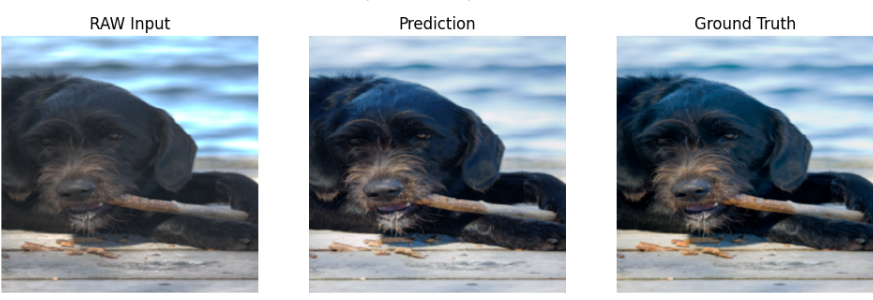

# 🔮 Image-Color-Enhancement
This project implements **deep learning** models for automatic color correction of RAW images, aiming to enhance image quality by mapping unprocessed RAW inputs to professionally corrected outputs.

# 🚀 Features

Custom U-Net and Attention U-Net architectures for image-to-image translation.

## Loss Functions:

- L1 Loss (pixel-level reconstruction).

- Perceptual Loss using pretrained VGG16 (captures semantic similarity).

## Training Enhancements:

- Dropout regularization.

- Early Stopping with patience.

## Visualization: 
- Compare RAW Input, Model Prediction, and Ground Truth during training.

# 📂 Dataset

This project uses the Adobe FiveK Dataset [Dataset Link](https://www.kaggle.com/datasets/ahmedmohmedbalta/mitabovefivek), which provides RAW images and corresponding corrected images by professional photographers.

- 5000 RAW images → Input.

- 5000 Corrected images → Ground Truth target.

# 🏗 Model Architectures
## 🔹 U-Net

- Encoder-Decoder structure with skip connections.

- Captures both low-level and high-level features for effective reconstruction.

## 🔹 Attention U-Net

- Enhances U-Net with attention gates in skip connections.

- Model focuses on relevant regions of the image → cleaner and more accurate predictions.

# ⚙️ Installation
- Clone the repo and install dependencies:
  ```bash
  git clone https://github.com/HabibaMAtiia/Image-Color-Enhancement.git
  cd Image-Color-Enhancement
  pip install -r requirements.txt

# 📊 Example Result


# ✅ Future Improvements

- Experiment with GAN-based approaches (e.g., Pix2Pix, CycleGAN).
- Build a simple **web app** using frameworks like Gradio.
- Add evaluation metrics: PSNR, SSIM.

# 👤 Author
Developed by **Habiba Mohammad** (habibamohamad062@gmail.com).
